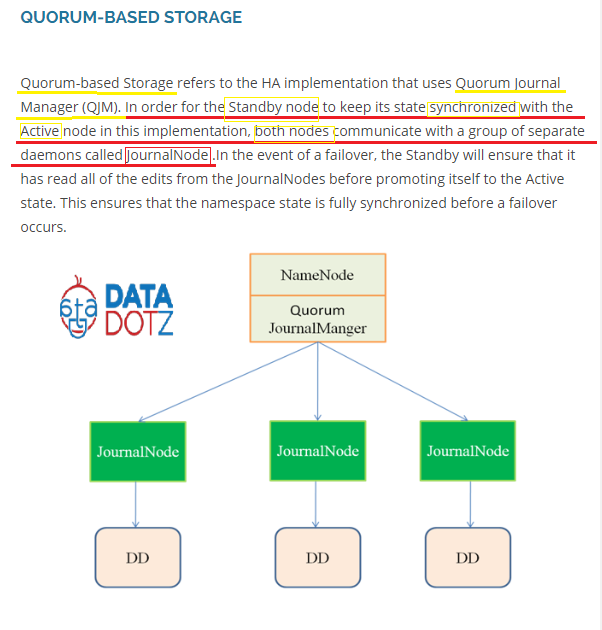

# Untitled

[http://datadotz.com/hdfs-namenode-high-availability-hadoop-2-x-part-1/](http://datadotz.com/hdfs-namenode-high-availability-hadoop-2-x-part-1/)

Hadoop1 以及 Hadoop2 的差別 ， 這邊文章主要講解 Hadoop 2.x的高可用性 \(High Availabilty\) 。

Hadoop 1 讀檔和寫檔， Hadoop1只有 Secondary NameNode 沒有 Standby NameNode。

Hadoop 2.x 寫檔和讀檔， 有Standby NameNode 會和 Active NameNode做

Fs sync \(log同步\) 和 checkpoint 定時確認狀態

介紹 HA \(高可用性\)

在Hadoop2.0.0以前， 在Hadoop叢集中NameNode是single point of failure\(SPOF\)， 每個叢集只有一個NameNode， 如果機器停用了， 整個叢集需要等到NameNode 再次啟用或著在別台機器上啟用一個新的NameNode之後才能繼續運作。

在只有單一NameNode的情況， 主要有兩種情況會對HDFS的可用性造成大的衝擊:

1. 未被計畫的情況 如: 機器崩壞 ， 整個叢集會停用直到 NameNode 重啟
2. 計畫中的維修， 如: 軟硬體的更新， NameNode會受到叢集的停機維修時間所影響

為了解決上述的問題， Hadoop2.x 上HDFS 的 高可用性\(HA\)特徵 提供運行一台多餘的NameNode \(共兩台NameNode\) 在同一個叢集中，並且兩台狀態分別為 Active/Passive， Standby的狀態為 熱備用。

如果啟用中的NameNode壞掉，備用的NameNode會快速接管。

NameNode 的責任

1. 啟用中的NameNode負責所有客戶端的運行。
2. Standby NameNode

One.會維持足夠的狀態來提供快速的故障移轉\(failover\)

Two.也會和 NameNode 進行狀態確認

隨時同步metadata \(元數據\) 的狀態 \(Synchronizing the state of metadata\)

1. Standby 必須要盡量讓其狀態和NameNode一致 ，

 有兩種方法可以讓 Standby NameNode 的 Edit logs 和 NameNode一致

One。 用 NFS \(網路檔案系統\) 來分享檔案

Two。 Quorum-based storage \(極為推薦， 後面會介紹\)

1. Block locations

DataNodes 會回傳blocks 數給NameNode 和 Standby NameNode

支持故障移轉模式 \(Supported Failover modes\)

1. 手動故障移轉

由管理者下專用命令去執行， 時間約0-3秒

1. 自動故障移轉

偵測到active NN 的錯誤， 實施fileover ， 時間約為30-40秒

 需要 Zookeeper 和 ZKFC

HDFS HA 聯合叢集 ????

Zookeeper 文章上寫錯字

Zookeeper 的介紹…。

Zookeeper的好處

1. 快速

Zookeeper 在讀檔寫檔速度比為 10:1

1. 可靠

Zookeeper 是由一個集合組成\(稱為合奏\)， 每個單體都會對其他感知， 只要

其中一台壞掉，另一台zookeeper就會啟用。

1. 簡單

Zookeeper 有個簡單且標準的等級制， 類似檔案和路徑

1. 有序

?????

面對 Automatic failover自動的錯誤移轉 \(無預期的機器崩壞\) 需要再 HDFS系統上部屬兩個新的物件， 1.Zookeeper quorum 2. ZKFC 。

會使用Zookeeper 處理 Automatic failover HDFS 因為其有兩個特性:

1. 錯誤偵測 : 每個在叢集中的active NN 都會在zookeeper維持一個狀態，當NN壞掉時， Zookeeper的session會到期， 屆時會通知standby NN 需要被啟用。 
2. 啟用中的NN選舉: Zookeeper 有個簡單的機制， 只選擇一位NN圍啟用狀態， 如果當前的啟用NN壞掉了， 另外的 NN 就會獲得一個 lock ，代表其會變成下一個 active NN

ZKFC

ZKFC是在Zookeeper中新的元件， ZKFC 也會監控和管理NN的狀態，

每一個跑NameNode的裝置同時也會運行 ZKFC

ZKFC的功能:

1. Health monitoring 健康度監控:

ZKFC會週期性的戳其負責的NameNode， 如果NN呈現一個不健康的狀態，

ZKFC就會標記該NameNode為不健康

1. Zookeeper session management

如果NN為健康狀態， ZKFC會知會Zookeeper該NN為健康。

如果NN為啟用狀態\(active\)，ZKFC會持有一個叫做 “lock” 的標記， 代表著其為 Active NameNode。

如果ZKFC和Zookeeper的溝通結束 \(代表著NN出問題\)， lock會自動被刪除。

1. Zookeeper-based election

如果NN為健康狀態，且沒有其他NN持有lock， ZKFC自己會去爭取獲得此lock， 如果成功就”贏得選舉”。 然後 ZKFC就要負起錯誤移轉以及讓NN啟用的責任。

Quorum-based Storage 是用一個稱作 Quorum journal Manager\(QJM\)來運行。

為了讓Standby NN 和 Active NN達到同步化， 兩個NN都會對一群稱為

JournalNode 的裝置去溝通/連接。

在failover的過程中， Standby會確保其已經讀過所以在JournalNode的edits，才將自己升為Active。

